# Spotify System Design

## **Introduction**

Music streaming has fundamentally changed how people consume audio content. A platform like Spotify serves hundreds of millions of users globally, delivering songs, podcasts, and playlists with near-instant playback. Behind this seamless experience lies a complex distributed system that must handle massive catalog storage, real-time streaming, personalized recommendations, and concurrent access from millions of devices.

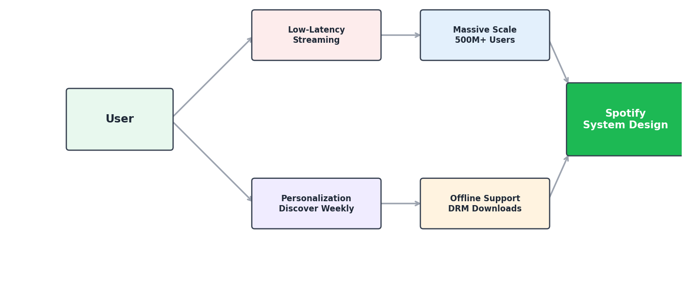

Building such a system involves solving several key challenges:

* **Low-Latency Streaming:** Users expect songs to start playing almost instantly when they press play, regardless of their location or network conditions.
* **Massive Scale:** The system must store and serve tens of millions of tracks to hundreds of millions of users simultaneously, handling billions of stream events per day.
* **Personalization:** Each user sees a unique home feed, personalized playlists (like Discover Weekly), and recommendations tailored to their listening history and preferences.
* **Offline Support:** Users on premium plans can download songs for offline playback, requiring secure local storage and DRM protection on their devices.

To address these challenges, we design a **music streaming platform** that handles **audio ingestion, storage, real-time streaming, search, recommendations, and playlist management** at scale. This system combines content delivery, real-time data processing, and machine learning to provide a seamless listening experience.

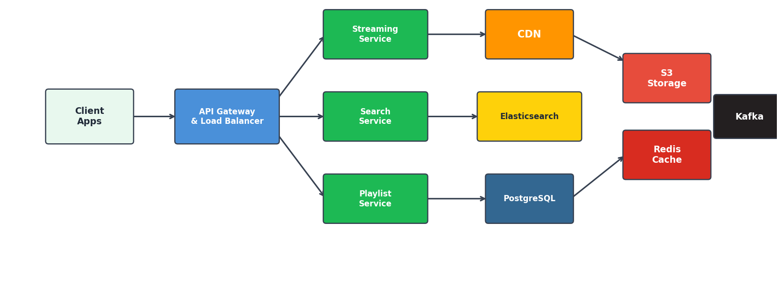

## **System Requirements**

**_Functional Requirements_:**

* **Music Streaming:** Users should be able to search for songs, albums, artists, and podcasts, and stream audio content in real-time with minimal buffering.
* **Playlist Management:** Users can create, edit, share, and follow playlists. The system should also generate personalized playlists (e.g., Discover Weekly, Daily Mix) using recommendation algorithms.
* **Search:** Provide fast, relevant search results across songs, artists, albums, podcasts, and playlists. Support autocomplete and fuzzy matching for partial or misspelled queries.
* **User Library & History:** Users can like songs, follow artists, save albums, and view their listening history. This data feeds into personalization.
* **Audio Upload & Ingestion:** Artists/labels upload audio files. The system transcodes them into multiple formats and bitrates, stores them, and makes them available for streaming.
* **Offline Downloads:** Premium users can download tracks for offline playback with proper DRM encryption.

**_Non-Functional Requirements_:**

* **Low Latency:** Song playback should start within 200ms of pressing play. Search results should return within 100ms.
  _Target latencies_: play start p95 ≤ 200 ms; search p95 ≤ 100 ms.
* **High Scalability:** The system should support 500M+ users, 100M+ tracks, and handle 10B+ stream events per day.
  _Scale targets_: concurrent streams ≈ 50M, peak QPS ≈ 500K, storage ≈ 500+ PB.
* **High Availability:** The platform should be available 99.99% of the time. Music playback should continue even if some backend services are degraded.
  _Availability target_: end-to-end ≥ 99.99%.
* **Data Consistency:** Playlist edits, likes, and follows should be consistent across devices. Eventual consistency is acceptable for recommendations and play counts, but user-initiated actions should reflect quickly.

## _High Level Design_

## **Audio upload and ingestion pipeline**

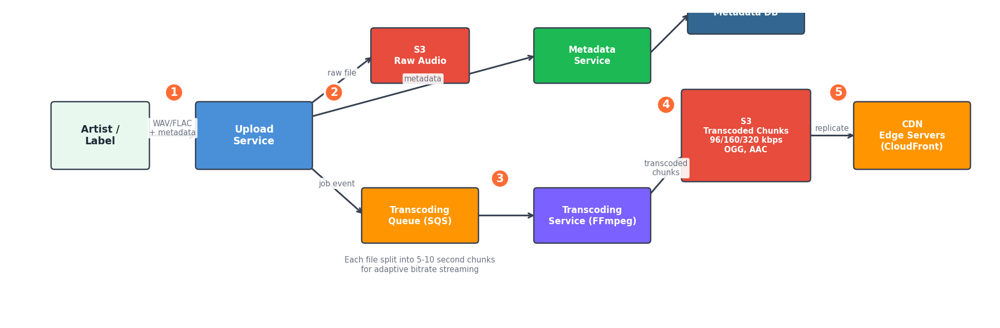

1. An artist or label uploads a raw audio file (WAV/FLAC) along with metadata (title, album, artist, genre, etc.) through the **Upload Service**.
2. The upload service stores the raw file in **Object Storage (S3)** and publishes an event to the **Transcoding Queue** (SQS/Kafka).
3. The **Transcoding Service** picks up the job and converts the audio into multiple formats and bitrates:
   * OGG Vorbis at 96, 160, 320 kbps
   * AAC at 128, 256 kbps
   * Each transcoded file is split into small **chunks** (typically 5-10 seconds each) for adaptive bitrate streaming.
4. Transcoded chunks are stored back in **Object Storage (S3)** and replicated to **CDN edge servers** globally.
5. The **Metadata Service** stores song metadata (title, artist, album, duration, genre, release date) in the **Metadata Database** and makes the track searchable.

**Technology chosen**

* **S3 (Object Storage)**: Highly durable, cost-effective storage for audio files. Supports lifecycle policies for managing different storage tiers.
* **FFmpeg**: Industry-standard transcoding tool for converting between audio formats and bitrates.
* **CDN (CloudFront/Akamai)**: Caches audio chunks at edge locations worldwide for low-latency playback.

## **Music streaming and playback**

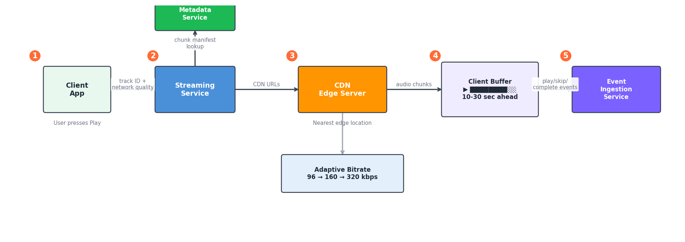

1. When a user presses play, the **Client App** sends a request to the **Streaming Service** with the track ID and the user's current network quality.
2. The Streaming Service looks up the track's chunk manifest (list of audio chunk URLs) from the **Metadata Service** and returns CDN URLs for the audio chunks.
3. The client begins fetching audio chunks from the nearest **CDN edge server**. It uses **adaptive bitrate streaming** — starting with a lower bitrate and switching to higher quality as the buffer fills up.
4. The client maintains a **buffer** of 10-30 seconds of audio ahead of the current playback position. If the network degrades, it switches to a lower bitrate to avoid buffering.
5. Each stream event (play, pause, skip, complete) is sent to the **Event Ingestion Service** for analytics, royalty calculations, and recommendation training.

**Why Chunked Streaming?**

* Allows **adaptive bitrate switching** mid-song without re-downloading.
* Enables **seeking** to any point in a song by fetching just the right chunk.
* Reduces wasted bandwidth if a user skips a song partway through.

**Technology chosen**

* **HLS/DASH-like chunked delivery**: Audio is split into small segments served via HTTP from CDN, allowing adaptive quality.
* **CDN with edge caching**: Ensures chunks are served from the closest server to the user, minimizing latency.

## **Search system**

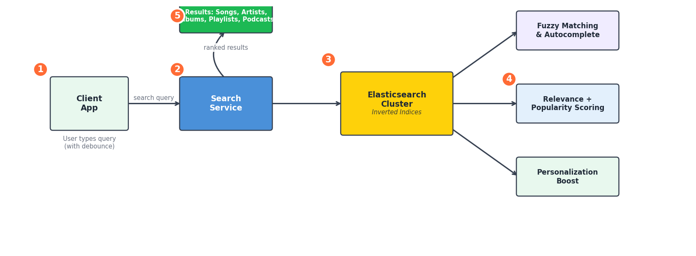

1. When a user types a query, the **Client App** sends it to the **Search Service** after a small debounce delay.
2. The Search Service queries an **Elasticsearch** cluster that indexes song titles, artist names, album names, podcast titles, and playlist names.
3. Elasticsearch uses **inverted indices** to quickly find matching documents. It supports fuzzy matching (handling typos), autocomplete (prefix matching), and relevance scoring (boosting popular results).
4. Results are ranked using a combination of **text relevance**, **popularity** (play count), **recency**, and **personalization** (user's listening history and preferences).
5. The Search Service returns ranked results to the client, grouped by type (songs, artists, albums, playlists, podcasts).

**Technology chosen**

* **Elasticsearch**: Purpose-built for full-text search with fuzzy matching, autocomplete, and relevance tuning. More details on search systems can be found in [Search System Design](../7.%20Design%20Search%20System/Search%20Systems%20Design.md).

## **Recommendation engine**

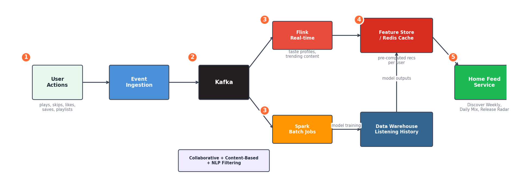

1. The **Event Ingestion Service** collects all user interactions (plays, skips, likes, saves, playlist additions) and streams them into **Kafka**.
2. A **Stream Processing Layer (Flink)** processes events in real-time to update user taste profiles and compute trending/popular content.
3. **Batch Processing (Spark)** runs periodically on the full listening history stored in the **Data Warehouse** to train recommendation models:
   * **Collaborative Filtering**: "Users who listened to X also listened to Y."
   * **Content-Based Filtering**: Analyze audio features (tempo, energy, key) and metadata (genre, artist) to find similar tracks.
   * **NLP on Playlists**: Analyze playlist names and descriptions to understand context (e.g., "chill vibes", "workout energy").
4. Model outputs (pre-computed recommendations per user) are stored in a **Feature Store / Cache (Redis)** for fast retrieval.
5. When a user opens the app, the **Home Feed Service** pulls their pre-computed recommendations from the cache and assembles the home screen (Discover Weekly, Daily Mixes, Release Radar, etc.).

**Technology chosen**

* **Kafka + Flink**: Real-time event processing for immediate signal capture.
* **Spark**: Batch model training on massive datasets.
* **Redis**: Low-latency serving of pre-computed recommendations.
* **Collaborative + Content-Based Filtering**: Hybrid approach gives better results than either alone.

## **Playlist service**

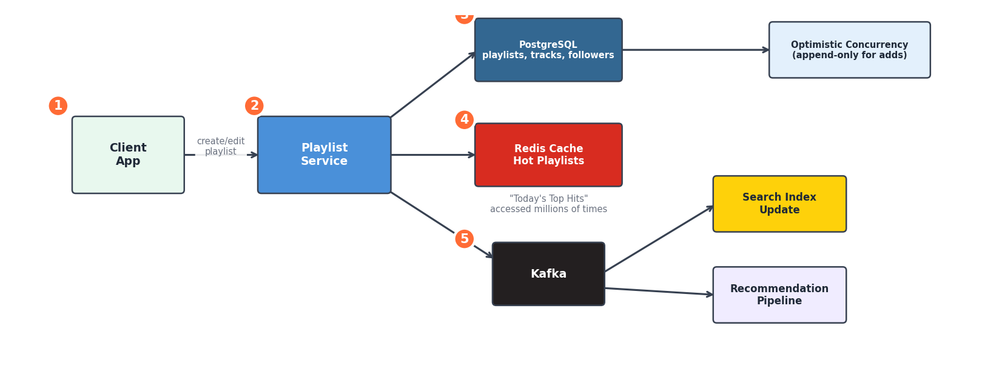

1. When a user creates or edits a playlist, the request goes to the **Playlist Service**.
2. The Playlist Service stores playlist data in a **relational database (PostgreSQL)** with tables for playlists, playlist_tracks (ordered list of track IDs), and followers.
3. For shared/collaborative playlists, the service uses **optimistic concurrency control** — if two users add a song at the same time, both additions succeed (append-only). Conflicts only arise on reordering, which is rare.
4. Playlist metadata (name, cover image, description, follower count) is cached in **Redis** for fast retrieval since popular playlists (like "Today's Top Hits") are accessed millions of times.
5. When a playlist is updated, a **change event** is published to Kafka, which triggers updates to the search index and the recommendation pipeline.

**Technology chosen**

* **PostgreSQL**: Strong consistency for user-owned data. ACID transactions ensure playlist edits are reliable.
* **Redis**: Caching layer for hot playlists.
* **Kafka**: Event propagation for search index and recommendation updates.

## **User interaction and social features**

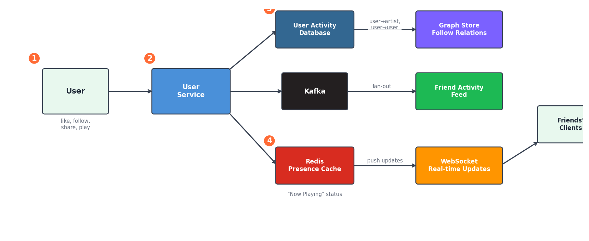

1. User actions like **liking a song**, **following an artist**, or **sharing a playlist** are handled by the **User Service**.
2. These interactions are stored in a **User Activity Database** and also published as events to Kafka.
3. The social feed (Friend Activity — showing what friends are listening to) is powered by a **fan-out** approach:
   * When a user plays a song, their "now playing" status is pushed to a **presence cache (Redis)**.
   * Friends' clients periodically poll or subscribe (via WebSocket) to updates from this cache.
4. Follow relationships (user → artist, user → user) are stored in a **graph structure** which can be queried to find mutual connections or suggest new artists.

**Technology chosen**

* **Redis**: Real-time presence/status cache for "now playing" features.
* **WebSockets**: Persistent connections for real-time friend activity updates.
* **Kafka**: Asynchronous event processing for activity feeds.

So, that gives us the final design as:
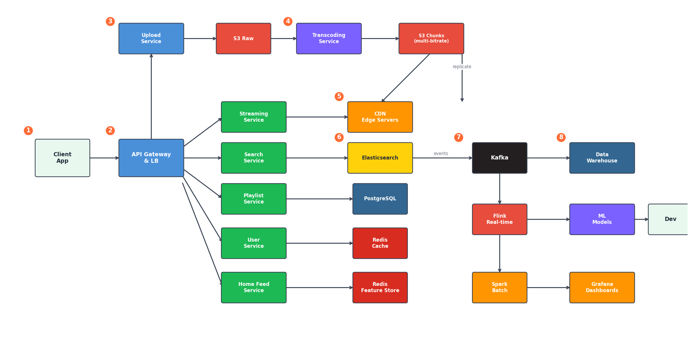

## DEEP DIVE INSIGHTS

### Audio Encoding and Adaptive Bitrate Streaming

* Why do we need multiple bitrates?
    * Users listen on different devices with different network conditions. A user on WiFi at home can enjoy 320 kbps high-quality audio, while a user on a spotty cellular connection needs 96 kbps to avoid buffering. Serving a single bitrate would either waste bandwidth or cause constant buffering.
* How adaptive bitrate streaming works in our design?
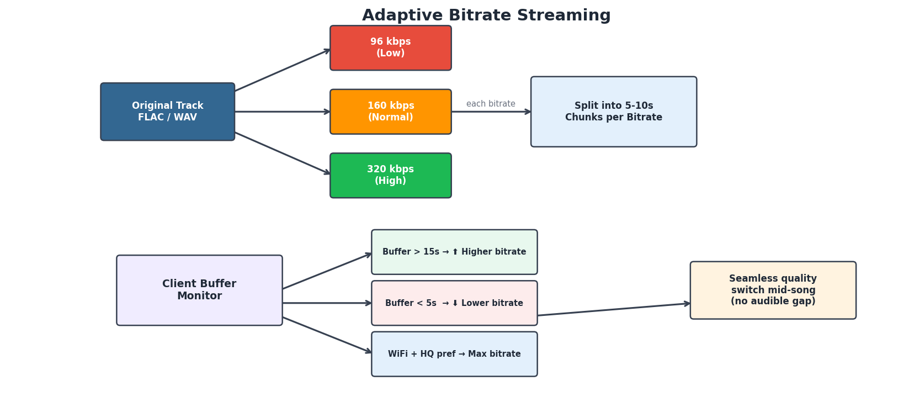
    * During transcoding, each track is encoded at multiple bitrates (e.g., 96, 160, 320 kbps) and split into small chunks (5-10 seconds each).
    * The client receives a **chunk manifest** — a list of available chunks at each bitrate level.
    * The client monitors its **download speed** and **buffer level** in real-time:
        * If the buffer is healthy (>15 seconds ahead), it requests higher bitrate chunks.
        * If the buffer is draining (<5 seconds ahead), it switches down to a lower bitrate.
        * If the user is on WiFi and has set a preference for high quality, it starts at the highest bitrate.
    * This approach is similar to how video streaming (HLS/DASH) works, but adapted for audio where chunks are smaller and transitions need to be seamless (no audible quality shifts mid-song).

### Content Delivery and Caching Strategy

* Why not serve audio directly from S3?
    * S3 is durable and cheap, but it's not optimized for low-latency delivery to global users. A user in Tokyo fetching from an S3 bucket in us-east-1 would experience significant latency. CDNs solve this by caching content at edge locations close to users.
* Multi-tier caching strategy:
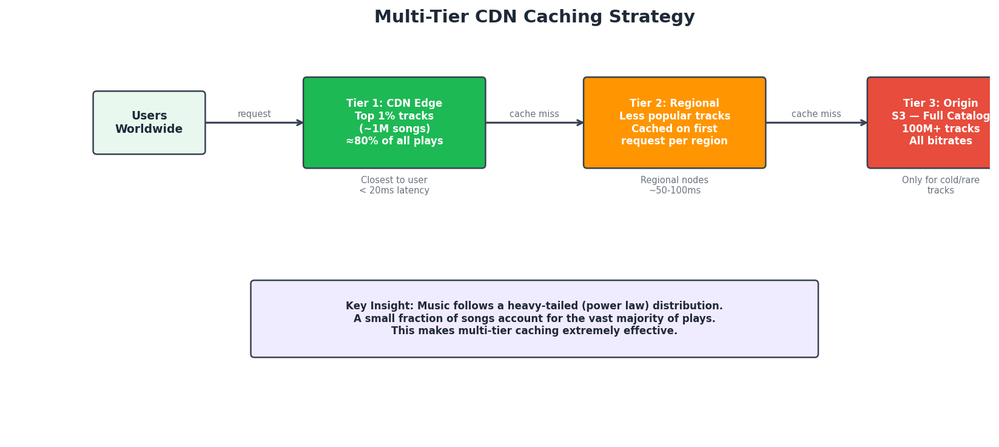
    * **Tier 1 — CDN Edge Cache**: The most popular tracks (top 1% — maybe 1M songs) are cached at all edge locations. These cover roughly 80% of all plays (power law distribution of music consumption).
    * **Tier 2 — CDN Regional Cache**: Less popular tracks are cached at regional CDN nodes. If a user in Europe requests a niche track, the regional node fetches it from origin and caches it.
    * **Tier 3 — Origin (S3)**: The full catalog lives here. Only cold/rare tracks are fetched directly from S3, and they get cached at regional and edge levels after the first request.
    * The key insight is that music follows a **heavy-tailed distribution** — a small fraction of songs account for the vast majority of plays. This makes caching extremely effective.

### Personalization Pipeline — How Discover Weekly Works

* Discover Weekly is generated once per week and is unique to every user. Here's how the pipeline works:
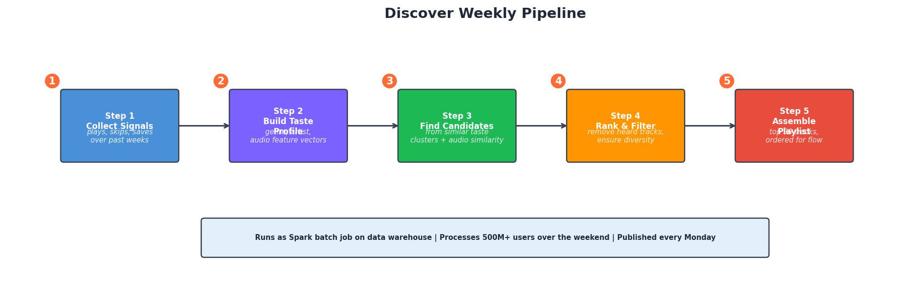
    * **Step 1 — Collect signals**: All user listening data for the past weeks is aggregated — songs played, skipped, saved, playlists created, time of day, etc.
    * **Step 2 — Build taste profile**: Using collaborative filtering, the system identifies "taste clusters" — groups of users with similar listening patterns. Your taste profile is a weighted vector of genres, artists, audio features, and listening contexts.
    * **Step 3 — Find candidate tracks**: From users in similar taste clusters, find tracks they loved that you haven't heard yet. Also find tracks with similar audio features (tempo, energy, valence) to your favorites.
    * **Step 4 — Rank and filter**: Rank candidates by predicted relevance. Filter out tracks you've already heard, tracks that are too obscure (minimum popularity threshold), and ensure diversity (don't fill the playlist with one genre).
    * **Step 5 — Assemble playlist**: Select the top 30 tracks, order them for a good listening flow (mix tempos, avoid back-to-back same artist), and publish to the user's library every Monday.
* This entire pipeline runs as a **Spark batch job** on the data warehouse, typically processing all 500M+ users over the weekend.

### Handling Offline Downloads with DRM

* How does offline playback work securely?
    * When a premium user downloads a track, the client fetches the audio chunks and stores them locally in an **encrypted format**.
    * The encryption key is tied to the user's **license**, which has an expiry (typically 30 days). The client periodically checks in with the **License Service** to renew the key.
    * If the user's subscription expires or they don't connect to the internet within the license window, the downloaded tracks become unplayable.
    * This is implemented using a **DRM system** (like Widevine or FairPlay) that handles key management, license issuance, and content decryption at the device level.
    * Downloaded tracks are stored in a **sandboxed app directory** that other apps cannot access, preventing easy extraction of the decrypted audio.
